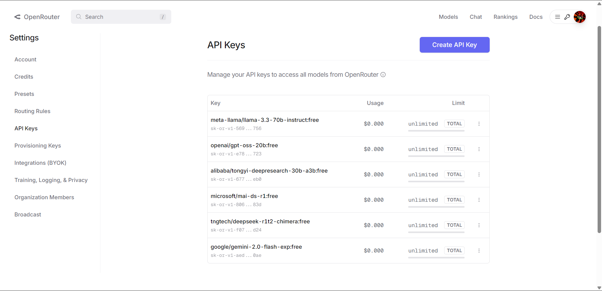
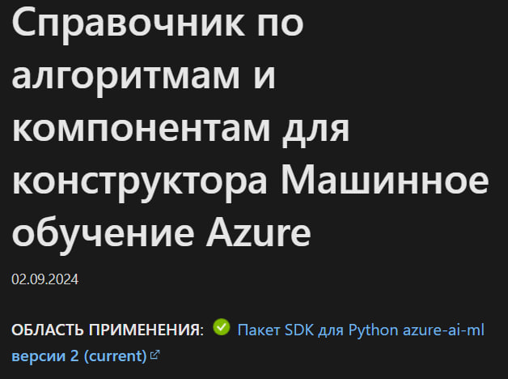
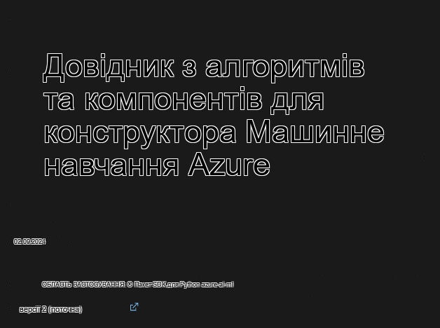
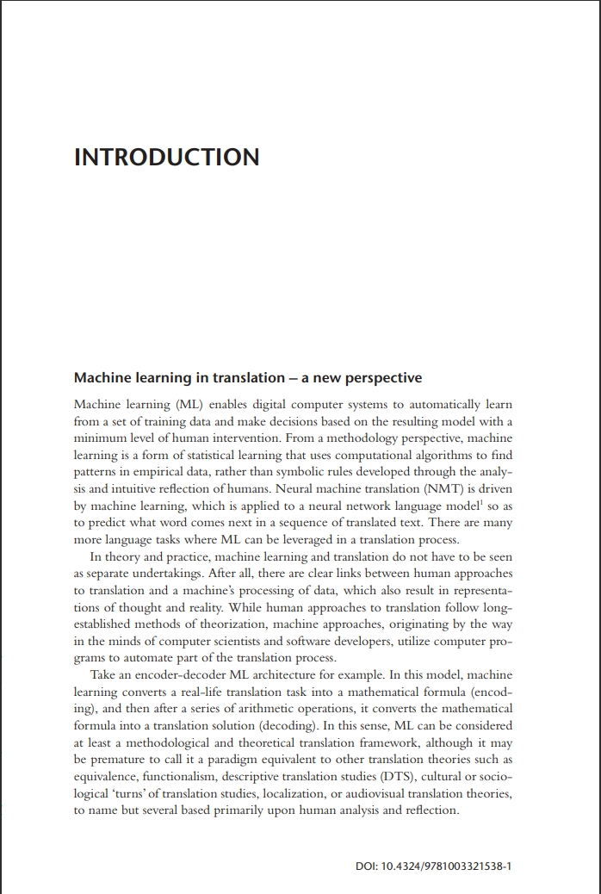
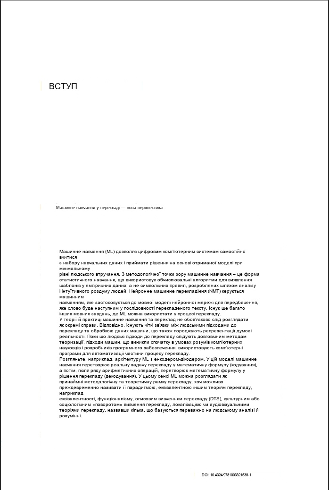
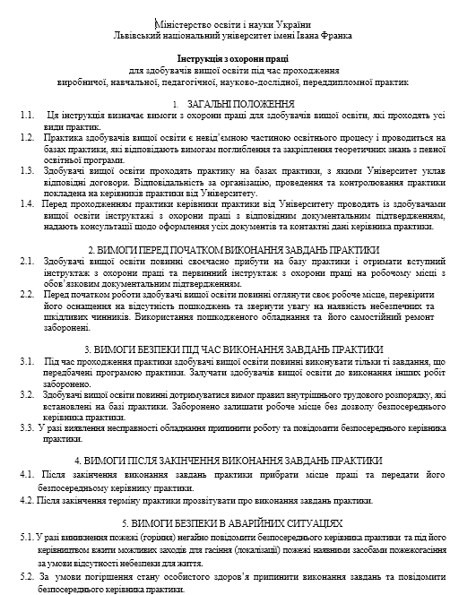
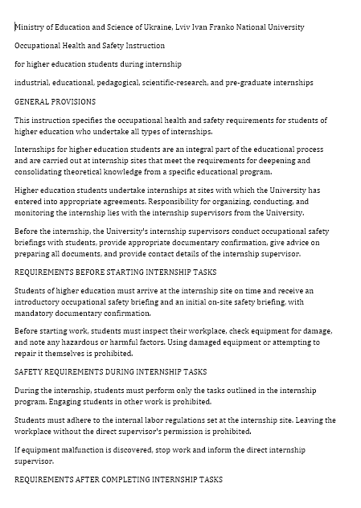

# 📘 Система OCR та перекладу документів

> Застосунок для розпізнавання тексту на зображеннях і в PDF-документах,
> автоматичного перекладу за допомогою веб-LLM та формування результату у вигляді зображення, TXT, DOCX або PDF.

---

## 👤 Автор

- **ПІБ**: Варіводін Максим Дмитрович
- **Група**: ФЕІм-24
- **Керівник**: Бойко Ярослав, кандидат фізико-математичних наук, доцент кафедри радіоелектронних і комп’ютерних систем
- **Дата виконання**: 04.12.2025

---

## 📌 Загальна інформація

- **Тип проєкту**: Десктопний / консольний застосунок
- **Мова програмування**: Python 3.12+
- **Фреймворки / Бібліотеки**:
  - OpenCV, Pillow — обробка зображень
  - pytesseract — OCR на базі Tesseract
  - pdf2image, pdf-бібліотека (для роботи з PDF)
  - OpenAI / OpenRouter client — доступ до веб-LLM для перекладу
  - python-docx, docx2pdf — робота з DOCX та експорт у PDF
  - pytest — модульні тести

---

## 🧠 Опис функціоналу

- 🔍 **Розпізнавання тексту (OCR)** на зображеннях та у PDF-документах
- 🌐 **Автоматичне визначення мови оригіналу** та переклад на задану мову за допомогою веб-LLM
- 🖼️ **Переклад тексту на зображеннях** з подальшим відтворенням перекладу у вихідному макеті (шрифт, положення, розміри)
- 📄 **Обробка документів** у форматах TXT, DOCX, PDF:
  - конвертація у перекладений TXT / DOCX / PDF
  - для цифрових PDF — робота з текстовим шаром, а не зі сканами сторінок
- ⚙️ Гнучкі налаштування: цільова мова, режим OCR, параметри Tesseract та Poppler через файл конфігурації
- 🧪 Набір модульних тестів для ключових компонентів (OCR, рендеринг, LLM-клієнт)

---

## 🧱 Опис основних модулів / файлів

| Модуль / Файл                    | Призначення |
|----------------------------------|-------------|
| `main.py`                        | Точка входу, CLI для перекладу зображень та документів |
| `ocr/llm/client.py`              | Налаштування клієнта OpenRouter / OpenAI, вибір моделі, health-check |
| `ocr/llm/translate.py`           | Високорівневі функції перекладу тексту та блоків документа через LLM |
| `ocr/llm/language_detector.py`   | Автоматичне визначення мови оригіналу |
| `ocr/ocr/reader.py`              | OCR: побудова DataFrame з pytesseract, групування у рядки/абзаци, розбиття на колонки |
| `ocr/image/processing.py`        | Попередня обробка зображень, пошук фону тощо |
| `ocr/render/draw.py`             | Відмальовування перекладеного тексту у вихідні прямокутники на зображенні |
| `ocr/pipeline/process.py`        | Пайплайн зображення: OCR → переклад → очищення зображення → відмальовування тексту |
| `ocr/docs/pipeline.py`           | Пайплайн документів TXT/DOCX/PDF: читання → переклад → запис DOCX/TXT/PDF |
| `ocr/docs/docx_io.py`            | Читання/запис DOCX у внутрішню модель `Document` |
| `ocr/docs/pdf_io.py`             | Робота з PDF (скановані та цифрові документи) |
| `ocr/docs/txt.py`                | Читання/запис TXT як набору параграфів |
| `config/models.json`             | Конфігурація моделей LLM (ідентифікатор, провайдер тощо) |
| `config/prompts.json`            | Шаблони промптів для перекладу (single/batch/document) |
| `config/dependencies.json`       | Шляхи до Tesseract та Poppler відносно кореня проєкту |
| `tests/*.py`                     | Модульні тести для основних підсистем |

---

## ▶️ Як запустити проєкт "з нуля"

### 1. Встановлення інструментів

- Python 3.12+ (рекомендовано 64-bit)
- Встановлений **Tesseract OCR** (у папці `..\\tesseract` відносно кореня проєкту)
- Встановлений **Poppler for Windows** (у папці `..\\poppler`)

### 2. Клонування репозиторію

```powershell
cd "D:\Projects\Masters degree\py"
git clone <URL_репозиторію> ocr
cd ocr
```

Якщо репозиторій уже знаходиться в цій папці, можна пропустити цей крок.

### 3. Створення та активація віртуального середовища

```powershell
cd "D:\Projects\Masters degree\py\ocr"
python -m venv .venv
.\.venv\Scripts\activate
```

### 4. Встановлення залежностей

```powershell
pip install --upgrade pip
pip install -r requirements.txt
```

Переконайтеся, що шляхи до Tesseract та Poppler задані у `config/dependencies.json`, наприклад:

```json
{
  "tesseract_path": "..\\tesseract\\tesseract.exe",
  "poppler_path": "..\\poppler\\Library\\bin"
}
```

### 4.1. Налаштування ключів доступу до веб‑LLM (OpenRouter)

Якщо в програмі немає валідних ключів доступу до API, їх потрібно створити самостійно на сайті OpenRouter:

- Сторінка створення ключів: https://openrouter.ai/settings/keys
- Приклад інтерфейсу налаштування ключів наведено на скріншоті:



Після створення ключів їх необхідно вписати у файл `config/models.json`.

Приклад структури цього файлу (ключі нижче замінені на псевдо‑значення, у вас мають бути реальні `sk-or-...`):

```json
{
  "model_number_picked": 4,
  "models": [
    {
      "provider": "google-ai-studio",
      "model": "google/gemini-2.0-flash-exp:free",
      "api_key": "sk-or-XXXXXXXXXXXXXXXXXXXXXXXXXXXXXXXXXXXXXXXXXXXXXXXX"
    },
    {
      "provider": "chutes",
      "model": "tngtech/deepseek-r1t2-chimera:free",
      "api_key": "sk-or-YYYYYYYYYYYYYYYYYYYYYYYYYYYYYYYYYYYYYYYYYYYY"
    },
    {
      "provider": "openrouter",
      "model": "microsoft/mai-ds-r1:free",
      "api_key": "sk-or-ZZZZZZZZZZZZZZZZZZZZZZZZZZZZZZZZZZZZZZZZZZ"
    }
  ]
}
```

Поле `model_number_picked` вказує, яку модель з масиву `models` використовувати за замовчуванням (нумерація з 1).

### 5. Приклад запуску перекладу зображення

```powershell
.\.venv\Scripts\activate
cd "D:\Projects\Masters degree\py\ocr"
python main.py --image "path\to\image.jpg" --target "English" --merge paragraph
```

### 6. Приклад запуску перекладу PDF-документа

```powershell
.\.venv\Scripts\activate
cd "D:\Projects\Masters degree\py\ocr"
python main.py --file "path\to\document.pdf" --out-format docx --translate --target "English"
```

Результат буде збережено поруч з оригінальним файлом з суфіксом `.translated.*`.

---

## 🧪 Тестування

Для запуску всіх модульних тестів використовуйте:

```powershell
.\.venv\Scripts\activate
cd "D:\Projects\Masters degree\py\ocr"
pytest
```

Модулі в `tests/` покривають обробку зображень, рендеринг тексту, роботу OCR та детектор мови.

---

## 🖱️ Інструкція для користувача (коротко)

1. **Переклад зображення**
   - Запустити команду з параметром `--image` і цільовою мовою `--target` (англійською назвою мови, наприклад `"English"`).
   - На виході отримуєте папку з оригінальним та перекладеним текстом (`original.txt`, `translated.txt`) і зображенням з накладеним перекладом.

2. **Переклад документа (TXT/DOCX/PDF)**
   - Використати параметр `--file` та формат виходу `--out-format` (`txt`, `docx` або `pdf`).
   - Додати прапорець `--translate`, якщо потрібен переклад, і `--target` для вибору мови.
   - Для цифрових PDF основний текст зчитується як текст, а графіки/фото додаються як зображення.

3. **Налаштування мов**
   - Назви мов у CLI мають бути **англійською** (`"English"`, `"German"`, `"Ukrainian"` тощо). Якщо ввести назву мовою оригіналу (наприклад, `"англійський"`), застосунок видасть помилку валідації.

---

## 🖼️ Приклади роботи

### Приклад 1: переклад окремого зображення



Результат роботи системи для цього зображення зберігається у папці `screenshots/to_rec/` і містить:

- `original.txt` — розпізнаний текст оригіналу;
- `translated.txt` — перекладений текст;
- `translated_image.jpg` — зображення з накладеним перекладом.

Приклад фінального зображення з перекладеним текстом:



### Приклад 2: сторінка з книжки (PDF / скріншот)



Результат роботи системи для цього прикладу зберігається у папці `screenshots/book_page2/` і містить:

- `original.txt` — розпізнаний текст сторінки;
- `translated.txt` — перекладений текст;
- `translated_image.jpg` — сторінка з відрендереним перекладом.

Приклад сторінки з перекладеним текстом:



### Приклад 3: переклад DOCX-документа

Оригінальний документ у форматі DOCX:



Після обробки застосунком створюється перекладена версія документа:



Перекладений файл зберігається поруч з оригіналом з суфіксом `.translated.docx` (або `.translated.pdf`, якщо обрано `--out-format pdf`).

---

## 🧾 Використані джерела / література

- Документація Tesseract OCR
- OpenCV та Pillow (обробка зображень)
- Офіційна документація OpenAI / OpenRouter API
- Документація python-docx, docx2pdf
- Статті та відповіді на StackOverflow щодо OCR, Poppler та обробки PDF у Python
